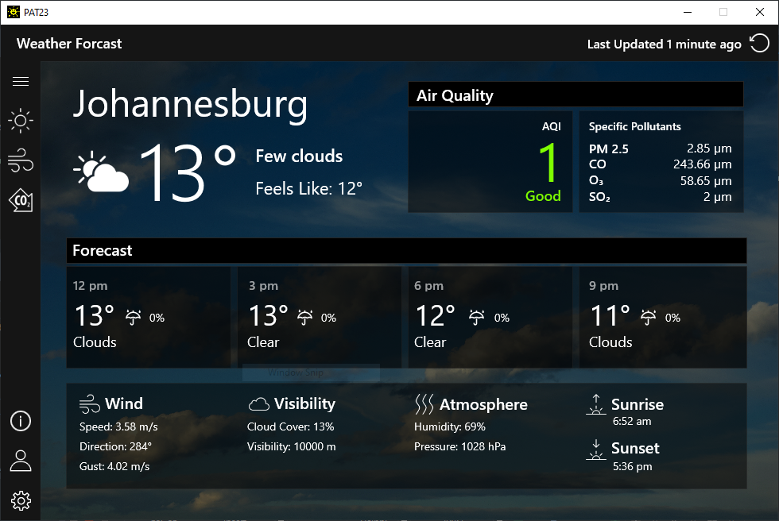
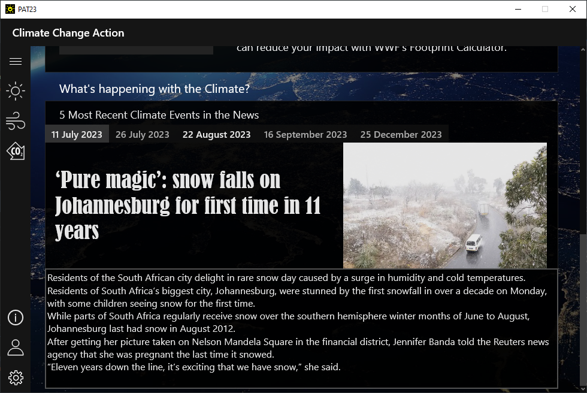
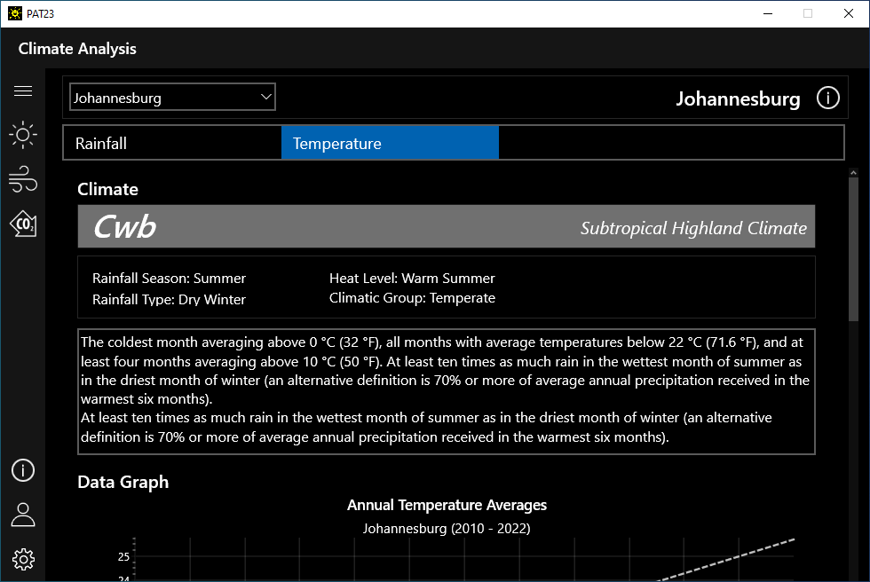
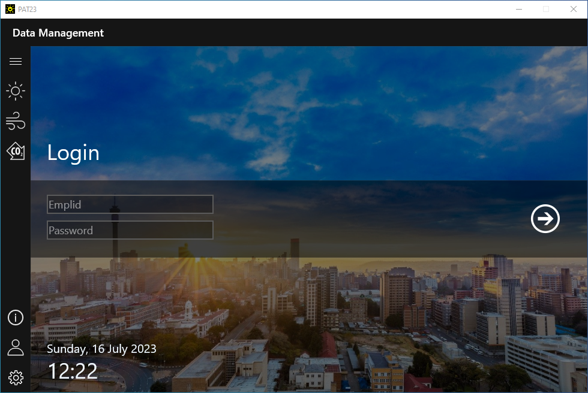

# Grade 12 IT Practical Assessment Task 2023
## Screenshots 
### Weather
  
- View current and forecasted weather for a specific location.

### Climate Action & News 
  
- View information about a Carbon Footprint and how to reduce yours.
- Calculate your Carbon Footprint using the WWF Environmental Footprint Calculator.
- View recent climate news. 

### Settings 
   
- Manage the connection to the climate database.
- Restart the application.

### Climate Analysis
 
- View up-to-date climate data, like annual average temperature and rainfall values.
- View temperature and rainfall data in a graph and in a table.
- View the climate trend for temperature and rainfall.
- Export/Print data and graphs.
- View information about a city.  

### Data Management 
   
- Query the database using SQL (Create, Read, Update and Delete).
- Export the query results.
- View activity within the system.
- Capture data for the database. 
