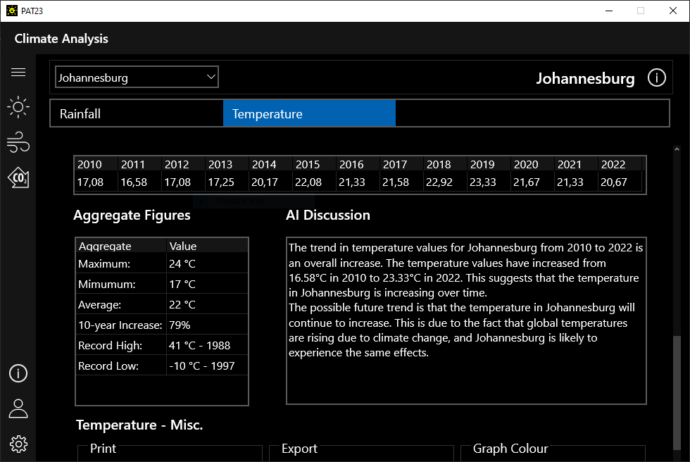

# Grade 12 IT Practical Assessment Task 2023
## What is the Practical Assessment Task (PAT)? 
A practical assessment task (PAT) mark is a compulsory component of the final
promotion mark for all candidates offering subjects that have a practical component
and counts 25% (100 marks) of the end-of-the-year examination mark. The PAT is
implemented across the first three terms of the school year. This is broken down into
different phases or a series of smaller activities that make up the PAT. The PAT
allows for learners to be assessed on a regular basis during the school year and it
also allows for the assessment of skills that cannot be assessed in a written format,
e.g. test or examination. It is therefore important that schools ensure that all learners
complete the practical assessment tasks within the stipulated period to ensure that
learners are resulted at the end of the school year. The planning and execution of the
PAT differs from subject to subject.

## About PAT-2023 
The 2023 PAT is a limited, climate analysis and tracking tool that also shows live weather data and a weather forecast as well as what a climate footprint is and what you can do to reduce it. The application also lets you use the WWF Environmental Footprint calculator and shows recent climate events across South Africa. 
***
## Screenshots 
Images showing the various screens of the application, what they do and how they look. 

### Weather
  
- View current and forecasted weather for a specific location.

### Climate Action & News 
  
- View information about a Carbon Footprint and how to reduce yours.
- Calculate your Carbon Footprint using the WWF Environmental Footprint Calculator.
- View recent climate news. 

### Settings 
   
- Manage the connection to the climate database.
- Change the database location.
- Manage the OpenAI API Key for the AI climate discussion. 
- Restart the application.

### Climate Analysis
  
- View up-to-date climate data, like annual average temperature and rainfall data for certain South African cities.
- View temperature and rainfall data in a graph and in a table.
- View the graphed climate trend for temperature and rainfall.
- Export/Print data and graphs.
- View information about a city.
- Read the OpenAI ChatGPT climate trend discussion.   

### Data Management 
   
- Query the database using SQL (Create, Read, Update and Delete).
- Export the query results.
- View activity within the system.
- Capture data for the database.

### About Screen


- View application license and developer information. 
- View application version information. 
***

## How to use PAT-2023 
Visit ```Releases``` and **download** the latest edition of the application. 
### The Database 
- The database name is ```PATDB.mdb``` and MUST be stored in the same working folder as the EXE. The EXE should be named ```PAT-2023.exe```. 

***
